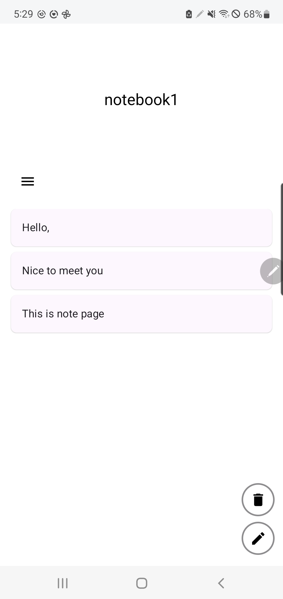
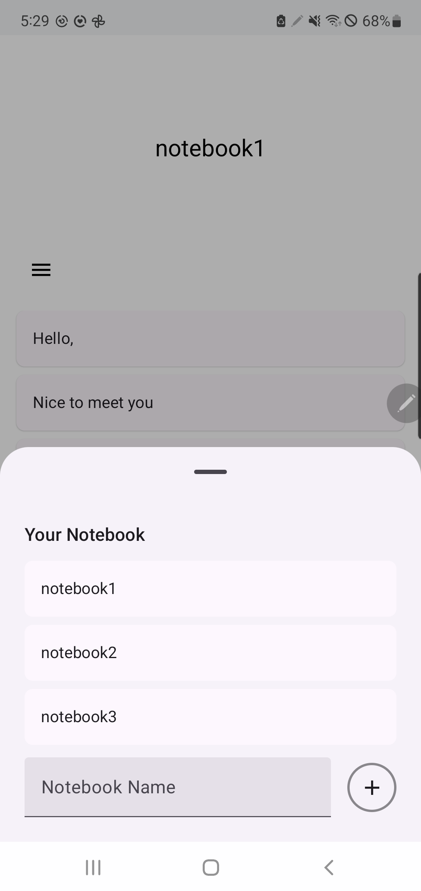
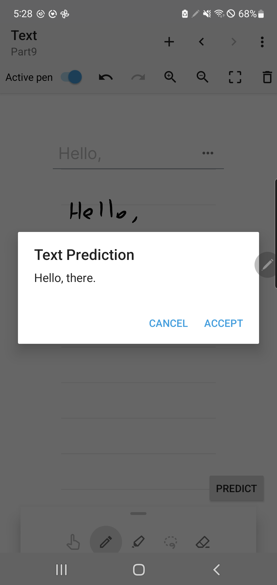

# Android App Project

## 📌 Project Overview

This project implements **notebooks and pages** using the **MyScript iink SDK**. Additionally, it integrates inline text prediction.

## 🚀 Getting Started

### Installation & Setup

1. Clone this repository:
   ```bash
   git clone https://github.com/dlwls5201/MyScript/tree/assignment
   ```
2. Claim a certificate to receive the free license to start developing your application by following the first steps of [Getting Started](https://developer.myscript.com/getting-started).
3. Copy this certificate to:
   ```
   GetStarted/src/main/java/com/myscript/certificate/MyCertificate.java  
   Demo/src/main/java/com/myscript/certificate/MyCertificate.java
   ```
4. Obtain a **Gemini API Key** from [Google AI Gemini API](https://ai.google.dev/gemini-api/docs/api-key).
5. Add the API key to your `local.properties` file:
   ```
   apiKey={your_gemini_api_key}
   ```

## 🛠️ Tech Stack

Technologies, frameworks, and libraries used in this project:

- **Language**: Kotlin/Java
- **Architecture**: MVVM / Clean Architecture
- **UI**: Jetpack Compose / XML
- **Handwriting Recognition**: [MyScript iink SDK](https://github.com/MyScript/interactive-ink-examples-android.git)
- **Text Prediction**: [Gemini AI](https://gemini.google.com/app?hl=ko)
- **Database**: Room
- **Dependency Injection**: Hilt
- **Others**: Coroutines, Flow, ViewModel, etc.

## ❌ Unresolved Issues

- I attempted to implement text prediction using TensorFlow.
- I chose [Hugging Face GPT-2 model](https://huggingface.co/openai-community/gpt2).
- I tried converting the GPT-2 model from Hugging Face to TFLite; below is the code I used
```
import tensorflow as tf
from transformers import GPT2Tokenizer, TFGPT2LMHeadModel

model_name = "openai-community/gpt2"
tokenizer = GPT2Tokenizer.from_pretrained(model_name)

model = TFGPT2LMHeadModel.from_pretrained(model_name, from_pt=True)  

h5_model_path = "gpt2_tf_model.h5"
model.save_pretrained(h5_model_path)

saved_model_path = "gpt2_tf_saved_model"
model = TFGPT2LMHeadModel.from_pretrained(h5_model_path) 
tf.saved_model.save(model, saved_model_path) 

print(f"✅ TensorFlow model saved to {saved_model_path}")

# Convert to TensorFlow Lite
converter = tf.lite.TFLiteConverter.from_saved_model("gpt2_tf_saved_model")
converter.optimizations = [tf.lite.Optimize.DEFAULT] 
tflite_model = converter.convert()

with open("gpt2_model.tflite", "wb") as f:
    f.write(tflite_model)

print("✅ TensorFlow Lite conversion completed! Model saved as gpt2_model.tflite")
```

### Result

I successfully imported it, but it is not working as expected. As a result, I decided to use the Gemini API for text prediction.

## 📸 Screenshots

### Notebook And Page Screen
- You can view the notebook title and pages
  

### Adding Notebook Screen
- You can create a new notebook in the bottom sheet.
  

### Text Prediction Screen
- Press the button to execute the text prediction function.
  
